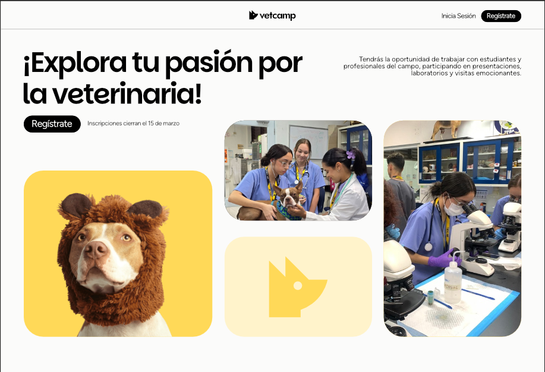

 <br>

### Check our documentation here:
[](https://deepwiki.com/ricmozz8/vetcamp)
<br>



<br>

## Requirements
It is important that you are not running any version higher than the `7.3.33` php version
since it will generate some compatibility errors.

### Installing the correct PHP Version
You may use the Chocolatey package manager for **Windows** to install the PHP Version
by using the following command:
```bash
choco install php --version=7.3
```

If you have a newer version you must allow the downgrade by using the following flag:
```bash
choco install php --version=7.3 --allow-downgrade 
```
## Running the project
In order to run the project you may do so by using the craft command:
```bash
php craft server 8000
```
This will start a server on port 8000.

### Accessing the database
First, in order to access the database, **you must
create an `.env` file** following the `.env.example` located in the root folder of this project.

## Creating Models, Views and Controllers
You may generate automatically models, views
and controllers using the `craft` command.

### Creating a model via `craft`
```bash
php craft model User
```
This will generate a User model under the 
 `/app/models` folder.

 ### Creating a controller via `craft`
```bash
php craft controller UserController
```
This will generate a controller under the 
`app/controllers` folder.

The same will work for views.

*PD: Feel free to extend this script to autogenerate files*